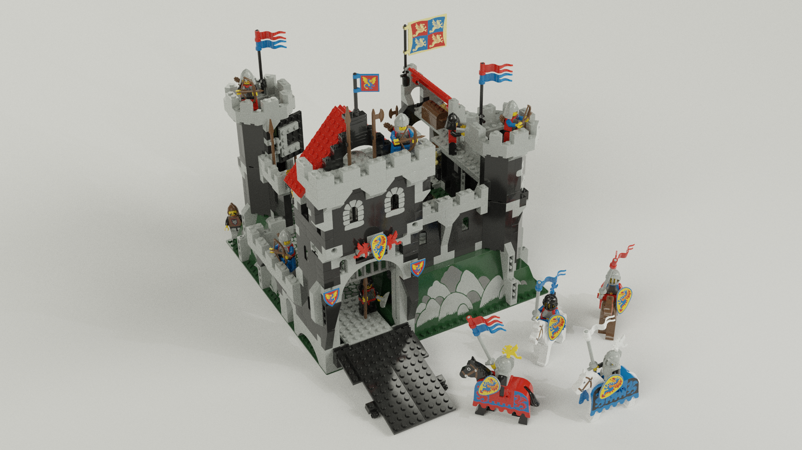
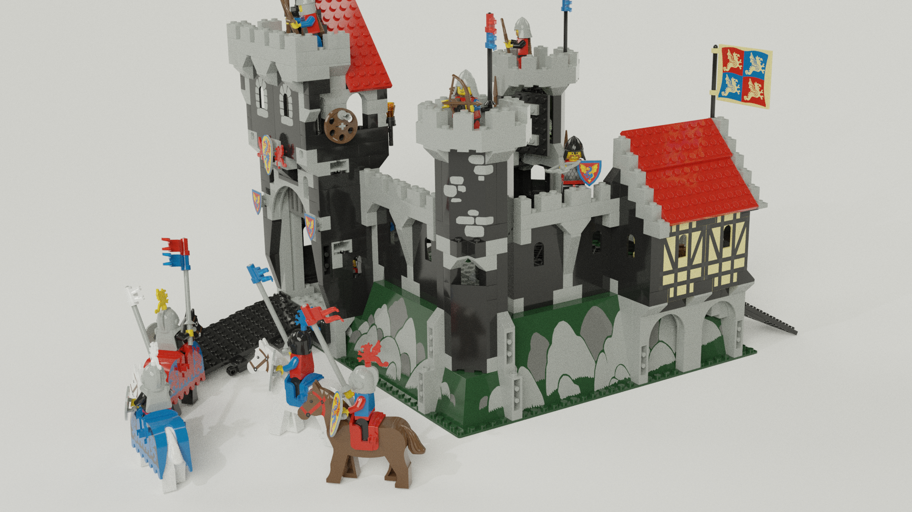
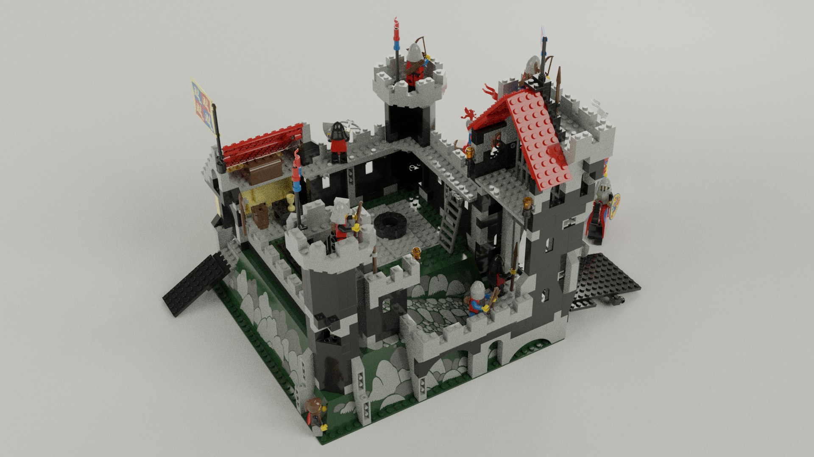
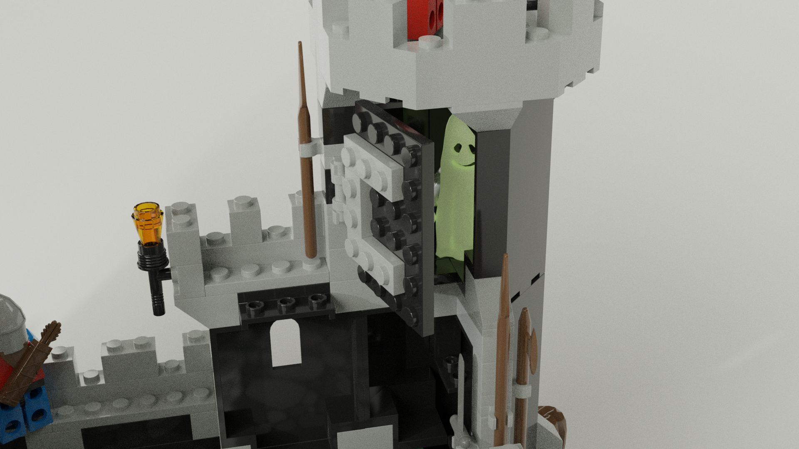

## An experiment with 3D Lego modeling using LeoCAD and Blender
------------------------------------------------------------

### Tutorial:
https://www.rm-media.net/photo-realistic-rendering-with-leocad-blender-linux-ubuntu/

### Used software:
* LeoCAD (3D modeling; https://www.leocad.org/)
* Blender (rendering; https://www.blender.org/)

### Requires:
* https://ldraw.org/parts/latest-parts.html
* https://github.com/TobyLobster/ImportLDraw/releases

### Original building instructions:
https://www.toysperiod.com/lego-set-reference/castle/black-knights/lego-6086-black-knights-castle/

### Final pictures:

